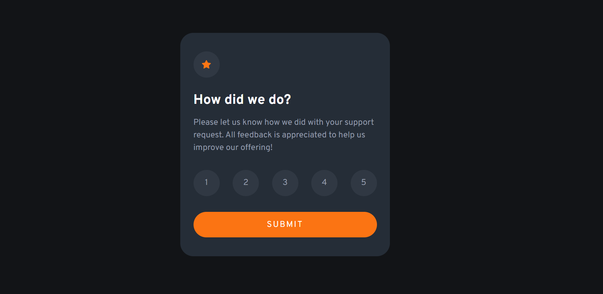

# Frontend Mentor - Interactive rating component solution

This is a solution to the [Interactive rating component challenge on Frontend Mentor](https://www.frontendmentor.io/challenges/interactive-rating-component-koxpeBUmI). Frontend Mentor challenges help you improve your coding skills by building realistic projects.

## Table of contents

- [Overview](#overview)
  - [The challenge](#the-challenge)
  - [Screenshot](#screenshot)
  - [Links](#links)
- [My process](#my-process)
  - [Built with](#built-with)
  - [What I learned](#what-i-learned)
  - [Continued development](#continued-development)
  - [Useful resources](#useful-resources)
- [Author](#author)

## Overview

### The challenge

Users should be able to:

- View the optimal layout for the app depending on their device's screen size
- See hover states for all interactive elements on the page
- Select and submit a number rating
- See the "Thank you" card state after submitting a rating

### Screenshot

### Links

- Solution URL: [Solution URL](https://your-solution-url.com)
- Live Site URL: 

## My process

### Built with

- Semantic HTML5 markup
- CSS custom properties
- Flexbox

### What I learned

I have learned not to let perfection stops me to finish this project and Share it with the world!

### Continued development

- I'm not so comfortable with JavaScript variable namings and soon i would improve them as i'm progressing!

### Useful resources

- [Google Fonts](https://fonts.google.com/) - An Awesome resource with a lot of free Fonts that you can use in your projects

## Author

- Frontend Mentor - [@theamiralizadeh](https://www.frontendmentor.io/profile/theamiralizadeh)
- Linkedin - [@amir-alizadeh](https://www.linkedin.com/in/amir-alizadeh/)